# Daily Fuel Tracker

Daily Fuel Tracker is a full-stack web application that allows users to track their daily nutrition and exercise activities. The project is designed with a real-world application mindset, including authentication, data tracking, and user-based operations.

---

## 🇬🇧 English

### Overview

Daily Fuel Tracker enables users to:

- Track daily meals and exercises
- Monitor records based on selected dates
- Manage user accounts securely
- Explore blog content related to nutrition

This project is not a simple demo; it is built with a scalable and structured architecture.

---

### Features

- User registration and login
- Account management (change password, logout, delete account)
- Add, view, and delete meals
- Add, view, and delete exercises
- Calendar-based daily tracking
- Blog listing and detail pages
- Demo user support for testing
- Responsive design (mobile, tablet, desktop)

---

### Tech Stack

#### Frontend
- React.js
- React Router
- HTML
- Plain CSS

#### Backend
- Node.js
- Express.js
- MSSQL
- JWT Authentication
- Cookie-based Authentication

#### Other Tools
- Azure SQL
- Vercel
- Render
- GitHub

---

### Project Structure

```
client/
server/
docs/
README.md
SUNUM_YAZISI.md
OZELLIKLER.md
```

---

### Running the Project

The project consists of two parts:

- client → frontend
- server → backend

#### 1. Start Backend

```
cd server
npm install
npm run dev
```

 #### 2. Start Frontend

```
cd client
npm install
npm run dev
```

#### 3. Utilization

- Backend runs API services
- Frontend runs UI
- Users can register, login, add meals and exercises, and track data


---

### Environment Variables

The following fields must be present in the .env file on the server side:

```env
PORT=5050
NODE_ENV=development
CLIENT_URL=http://localhost:5173
JWT_SECRET=change_me
COOKIE_SAME_SITE=lax
COOKIE_SECURE=false
DB_USER=sa
DB_PASSWORD=change_me
DB_SERVER=localhost
DB_PORT=1433
DB_NAME=daily_fuel_tracker
```

---

### Demo Account

- Email: demo@dailyfuel.local
- Password: Demo1234!

---

### Screenshots

Screenshots can be found in:

docs/screenshots/

---

### Live Demo

- Frontend: Coming soon
- Backend: Coming soon


---

## Screenshots

### Login Page
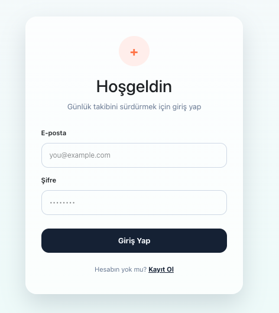

### Register Page
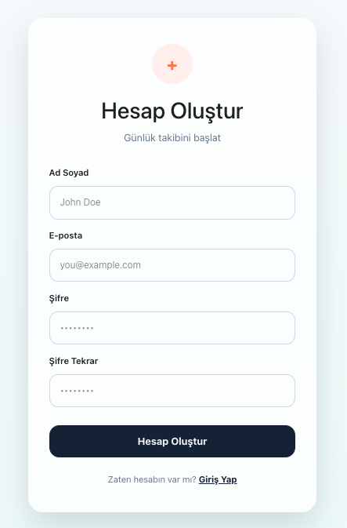

### Dashboard
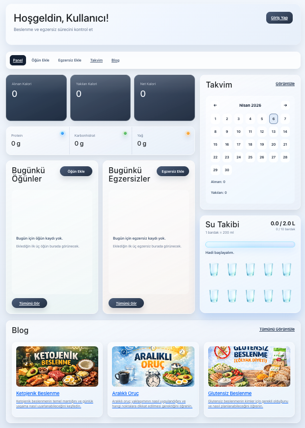

### Account Modal
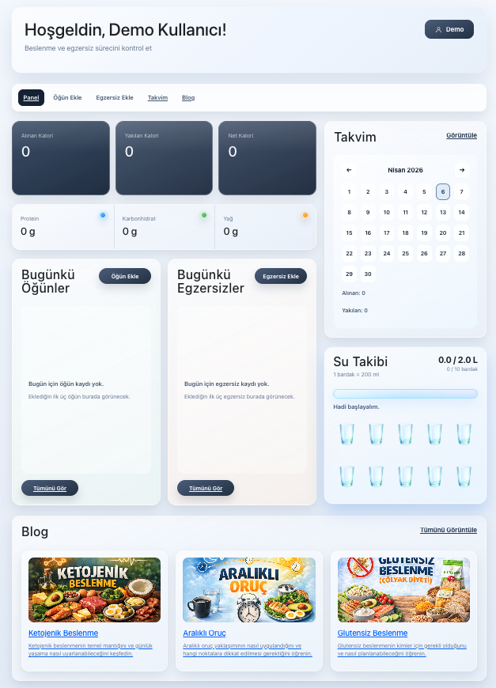

### Add Meal Drawer
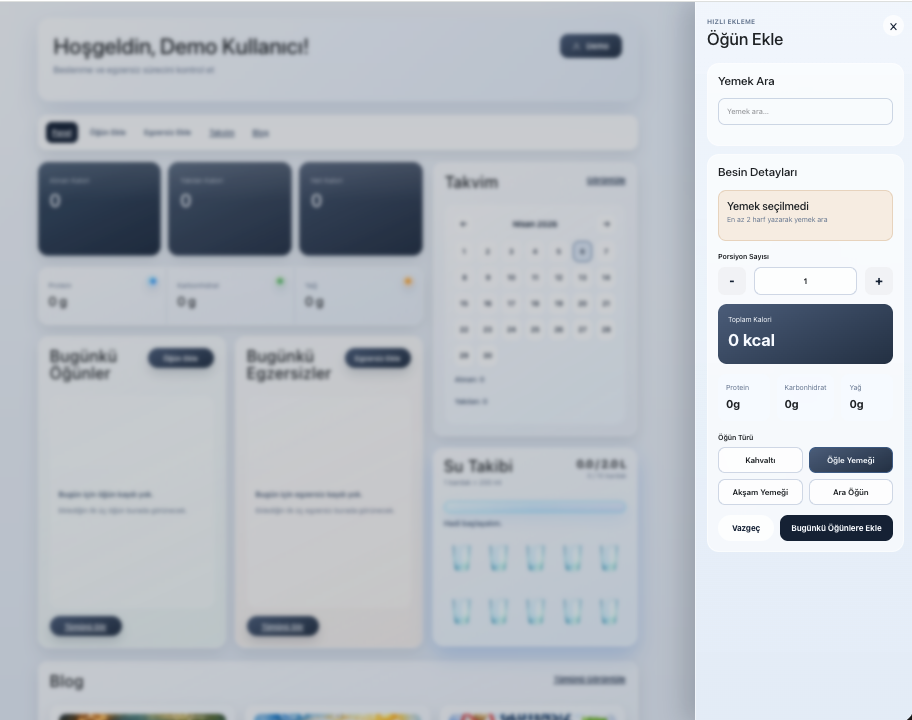

### Add Exercise Drawer
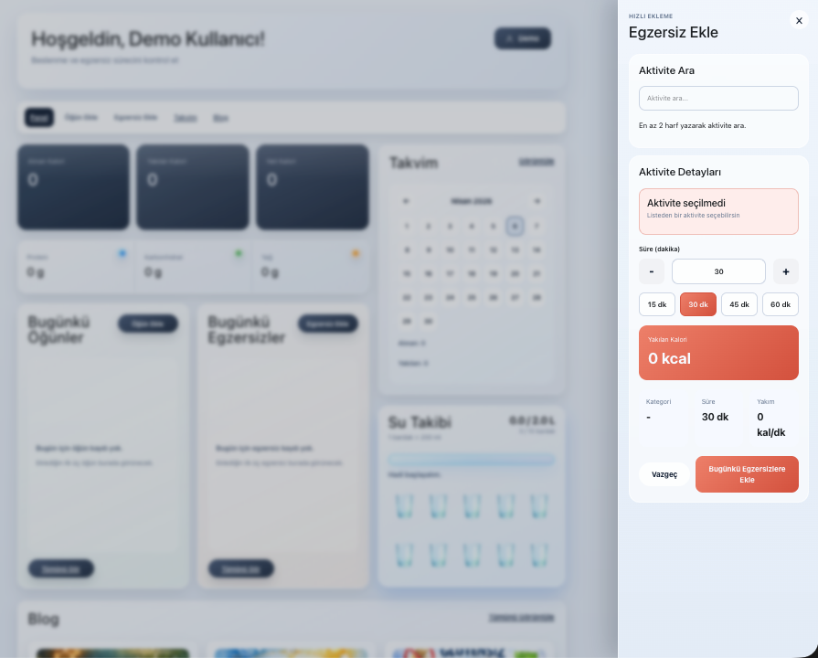

### Calendar Section
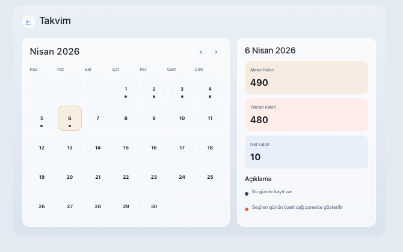

### Meal History
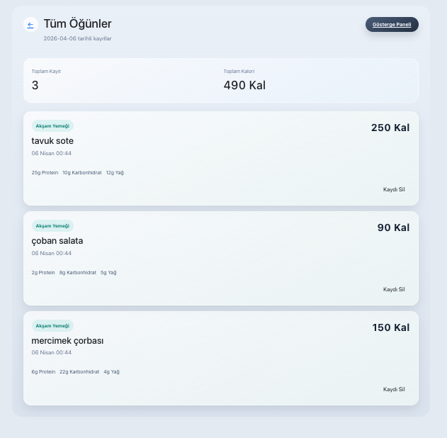

### Meal History Empty Example
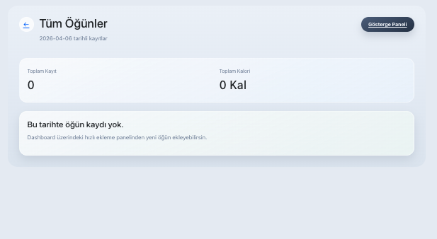

### Exercise History
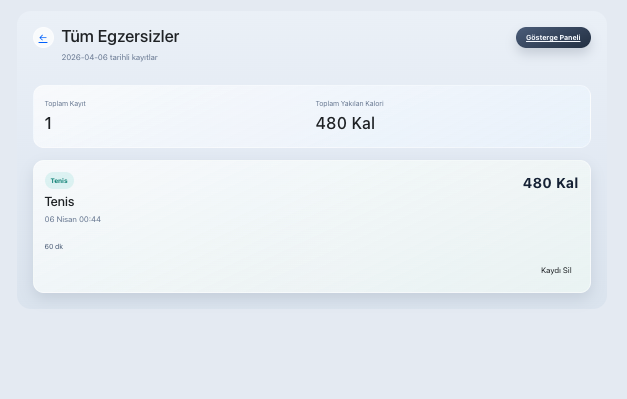

### Blog Listing
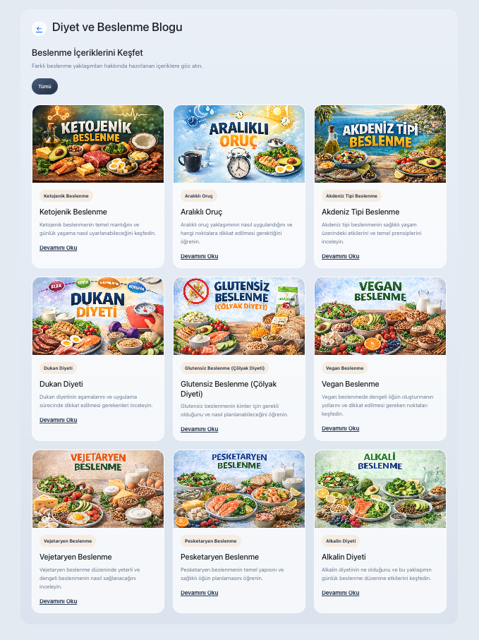

### Blog Detail
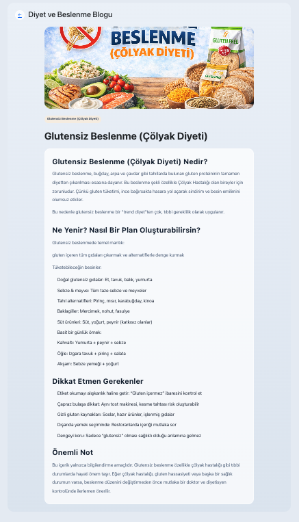

### Water Tracking


---

## 🇹🇷 Türkçe

Daily Fuel Tracker, kullanıcıların günlük beslenme ve egzersiz süreçlerini takip edebildiği bir web uygulamasıdır. Bu proje basit bir demo değildir; gerçek bir uygulama mantığıyla, kullanıcı yönetimi ve veri takibi odaklı geliştirilmiştir.

---

### Özellikler

- Kullanıcı kayıt olma ve giriş yapma
- Hesap yönetimi (şifre değiştirme, çıkış yapma, hesap silme)
- Günlük öğün ekleme, görüntüleme ve silme
- Günlük egzersiz ekleme, görüntüleme ve silme
- Takvim bazlı kayıt takibi
- Blog listeleme ve detay sayfaları
- Demo kullanıcı ile test edilebilir yapı
- Responsive tasarım (mobil, tablet, masaüstü)

---

### Kullanılan Teknolojiler

#### Frontend
- React.js
- React Router
- HTML
- Plain CSS

#### Backend
- Node.js
- Express.js
- MSSQL
- JWT Authentication
- Cookie tabanlı kimlik doğrulama

#### Diğer
- Azure SQL
- Vercel
- Render
- GitHub

---

### Proje Yapısı

```
client/
server/
docs/
README.md
SUNUM_YAZISI.md
OZELLIKLER.md
```

---

### Projeyi Çalıştırma

Proje iki bölümden oluşur:

- client → frontend
- server → backend

#### 1. Backend başlatma

```
cd server
npm install
npm run dev
```

#### 2. Frontend başlatma
```
cd client
npm install
npm run dev
```

#### 3. Kullanım
- Backend API servislerini çalıştırır
- Frontend arayüzü sağlar
- Kullanıcı giriş yapabilir, veri ekleyebilir ve görüntüleyebilir

---

### Çevre Değişkenleri

Server tarafında .env dosyasında aşağıdaki alanlar bulunmalıdır:

```env
PORT=5050
NODE_ENV=development
CLIENT_URL=http://localhost:5173
JWT_SECRET=change_me
COOKIE_SAME_SITE=lax
COOKIE_SECURE=false
DB_USER=sa
DB_PASSWORD=change_me
DB_SERVER=localhost
DB_PORT=1433
DB_NAME=daily_fuel_tracker
```

---

### Demo Kullanıcı

- E-posta: demo@dailyfuel.local
- Şifre: Demo1234!

---

### Ekran Görüntüleri

Ekran görüntüleri şu klasörde bulunur:

docs/screenshots/

---

### Canlı Linkler

- Frontend: Yakında
- Backend: Yakında

--

### Ekran Görüntüler

Ekran görüntüleri yukarıdaki bölümde yer almaktadır.